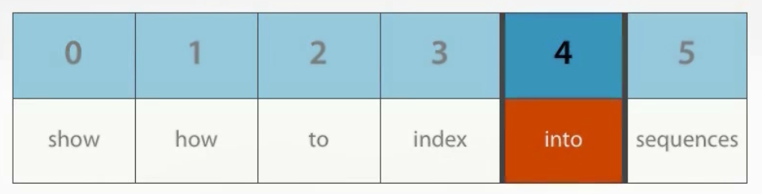
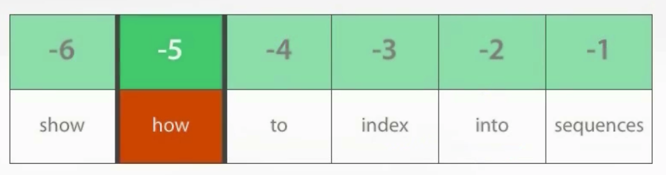
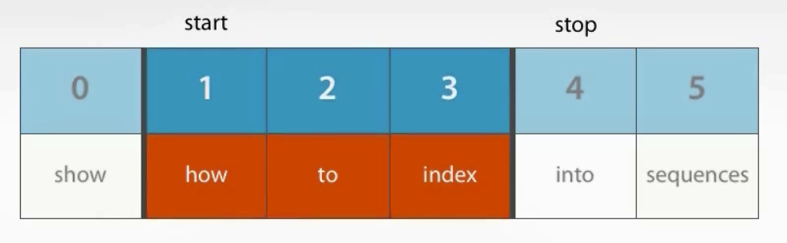
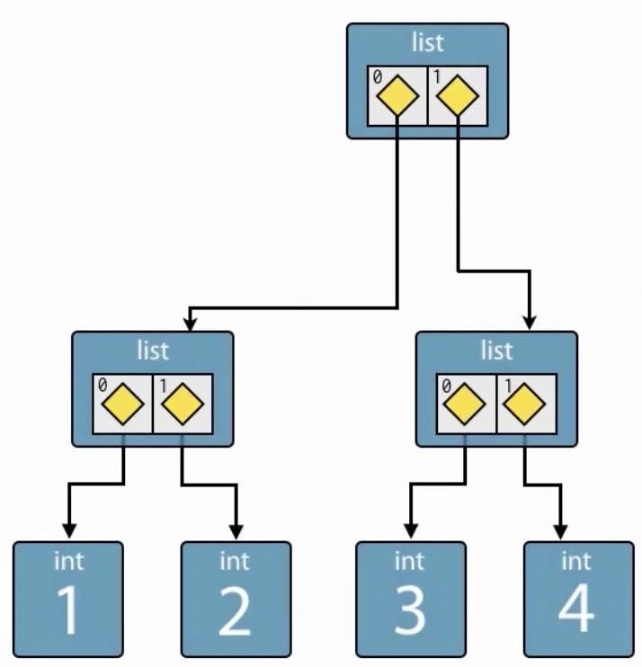
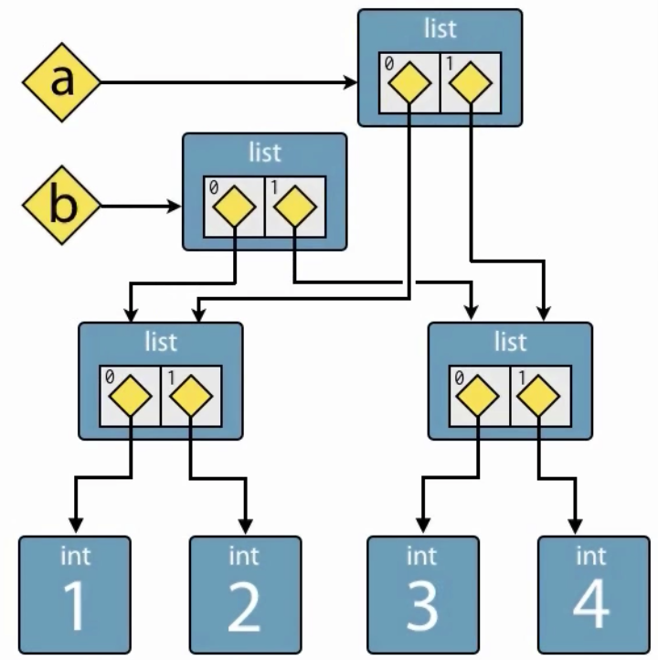
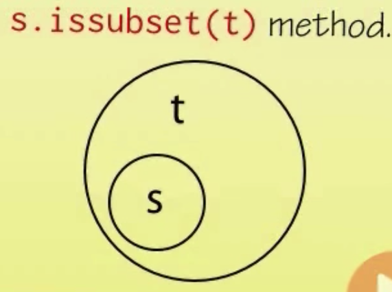
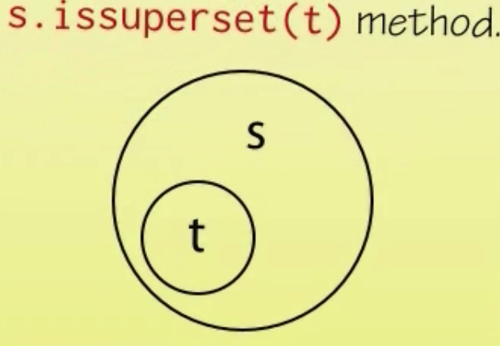
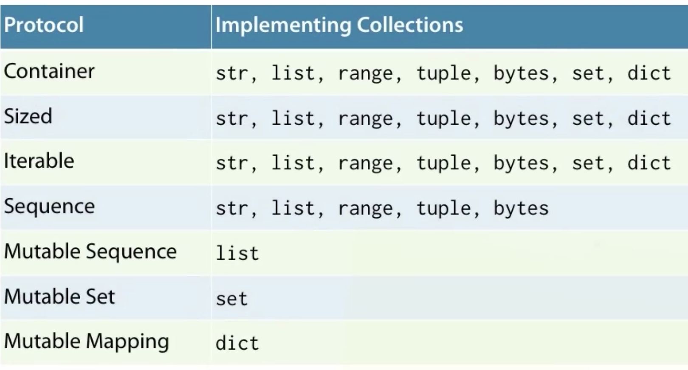

<!-- START doctoc generated TOC please keep comment here to allow auto update -->
<!-- DON'T EDIT THIS SECTION, INSTEAD RE-RUN doctoc TO UPDATE -->
**Table of Contents**  *generated with [DocToc](https://github.com/thlorenz/doctoc)*

- [Python Fundamentals](#python-fundamentals)
  - [Getting Started With Python 3](#getting-started-with-python-3)
    - [Scalar Types](#scalar-types)
    - [Relational Operators](#relational-operators)
    - [Conditional Statements](#conditional-statements)
    - [While Loops](#while-loops)
  - [Strings and Collections](#strings-and-collections)
    - [Strings](#strings)
    - [Bytes](#bytes)
    - [Lists](#lists)
    - [Dictionaries](#dictionaries)
    - [For Loops](#for-loops)
    - [Putting it all together](#putting-it-all-together)
  - [Modularity](#modularity)
    - [Creating, Running, and Importing a Module](#creating-running-and-importing-a-module)
    - [Defining Functions and Returning Values](#defining-functions-and-returning-values)
    - [Distinguishing Between Module Import and Module Execution](#distinguishing-between-module-import-and-module-execution)
    - [The Python Execution Model](#the-python-execution-model)
    - [Main Functions and Command Line Arguments](#main-functions-and-command-line-arguments)
    - [Sparse is better than Dense](#sparse-is-better-than-dense)
    - [Documenting Using Docstrings](#documenting-using-docstrings)
    - [Documenting With Comments](#documenting-with-comments)
    - [The Whole Shebang](#the-whole-shebang)
  - [Objects](#objects)
    - [Argument Passing](#argument-passing)
    - [Function Arguments in Detail](#function-arguments-in-detail)
    - [Python's Type System](#pythons-type-system)
    - [Variable Scoping](#variable-scoping)
    - [Everything is an object](#everything-is-an-object)
  - [Collections](#collections)
    - [Tuple](#tuple)
    - [String](#string)
    - [Range](#range)
    - [List](#list)
      - [Indexing](#indexing)
      - [Slicing](#slicing)
    - [Shallow Copies](#shallow-copies)
    - [List Repetition](#list-repetition)
    - [More on List](#more-on-list)
    - [Growing Lists](#growing-lists)
    - [Reversing and Sorting Lists](#reversing-and-sorting-lists)
    - [Dictionary](#dictionary)
      - [Pretty Printing](#pretty-printing)
    - [Set](#set)
    - [Collection Protocols](#collection-protocols)
  - [Handling Exceptions](#handling-exceptions)
    - [Exceptions and Control Flow](#exceptions-and-control-flow)
    - [Handling Exceptions](#handling-exceptions-1)
    - [Programmer Errors](#programmer-errors)
    - [Re-Raising Exceptions](#re-raising-exceptions)
    - [Exceptions as APIs](#exceptions-as-apis)
    - [Exceptions,APIS, and Protocols](#exceptionsapis-and-protocols)

<!-- END doctoc generated TOC please keep comment here to allow auto update -->

# Python Fundamentals

> My course notes from [Python Fundamentals](https://app.pluralsight.com/library/courses/python-fundamentals/table-of-contents) course on Pluralsight.

## Getting Started With Python 3

### Scalar Types

__int__

signed, arbitrary precision integer, eg `42`, specified in decimal but also can be binary with `0b` prefix, octal with `0o` prefix, or hex with `0x` prefix. Can also use constructor to convert other numeric types to int, for example `int(3.5)` returns `3` (rounds down). Strings can be converted to ints `int("496")` returns 496.

__float__

64-bit floating point numbers, implemented as IEEE-754 double precision floating point numbers with 53 bits of binary precision, which is around 15 to 16 bits of decimal precision.

any literla number containing a decimal point or `E` is interpreted as a float.

Can use scientific notation, for example `3e8`, which is 3 x 10 to power of 8, `1.616e-35` is 1.616 x 10 to power of negative 35.

`float` constructor can be used to convert other tyoes to float, for example int `float(7)` returns `7.0`, `float("1.618")` returns 1.618.

Can also create "not a number", and positive/negative infinity `float("nan")`, `float("inf")`, `float("-inf")`

Any calculation involving int and float is promoted to float, `3.0 + 1` is `4.0`.

__None__

The null object. The solve value of NoneType, used to represent absence of a value, not displayed by REPL.

Can be assigned to a variable `a = None`. Can test whether a variable is null `a is None` returns true.

__bool__

Boolean logical value, either `True` or `False`.

bool constructor can be used to convert other types. For integers, `bool(0)` is falsey, and all other int values are truthy.
Same behaviour with floats `bool(0.0)` is falsey, any other float is truthy.

Empty list is falsey `bool([])`, populated list is truthy `bool([1, 3, 5])`.

Empty string is falsey `bool("")`, any other non empty string is truthy.

### Relational Operators

Two objects are _equivalent_ if one could be used in place of the other.

`==` value equality / equivalence

`!=` value inequality / inequivalence

`<` less than

`>` greater than

`<=` less than or equal to

`>=` greater than or equal to

### Conditional Statements

```python
if expr:
  print("expr is True")
```

`expr` is converted to bool as if by the `bool()` constructor. So this evaluates to `True`

```python
if "eggs":
  print("Yes please!")
```

Optional else clause:

```python
h = 42
if h > 50:
  print("Greater than 50")
else:
  print("Less than 50")
```

Rather than nesting an `if` block in an `else` block, use `elif` keyword, because "zen of python" - "flat is better than nested"

### While Loops

`while` statment terminated by a colon because it introduces a new block. `expr` is converted to `bool` as if by the `bool()` constructor.

```python
while expr:
  print("loop while expr is True")
```

```python
c = 5
# equivalent would be: while c:, but more idiomatic python to be explicit as below:
while c != 0:
  print(c)
  c -= 1
```

`break` keyword terminates innermost loop and transfers execution to the first statement after the loop.

```python
while True:
  if expr:
    break
print("Go here on break")
```

## Strings and Collections

### Strings

data type `str`. Immutable sequences of Unicode codepoints. Codepoints are roughly like characters though not strictly equivalent.
Once a string is constructed, cannot modify its contents.

Literal strings are delimited by either single or double quotes, but must be consistent within a single string:

```python
'This is a string'
"This is also a string"
```

Adjacent strings are concatenated into a single string

```python
>>> "first" "second"
'firstsecond'
```

Newline options:

__Multiline strings__ - delimited by three quote characters (can be double or single quotes)

```python
>>>"""This is
a multiline
string"""
'This is\na multiline\nstring'
```

__Escape sequences__

Embed the newline control character right in the string

```python
>>> m = 'This string\nspans multiple\nlines'
```

Note Python 3 gas _Universal Newlines_, so no need on Windows to specify carriage return `\r\n`,
rather `\n` is translated to the native newline sequence on whatever platform the code is running on.

__Raw Strings__

"what you see is what you get". To avoid ugly escape sequences, especially useful with Windows paths.
To use it, precede string with `r'`

```python
>>> path = r'C:\Users\Merlin\Documents\Spells'
>>> path
'C:\\Users\\Merlin\\Documents\\Spells'
```

Strings are _sequence types_, which means they support common operations for querying sequences.

Can access certain characters in string using square brackets:

```python
>>> s = 'parrot'
>>> s[4]
'o'
>>> type(s[4])
<class 'str'>
```

There is no separate character type from string type. Characters are simply one element strings.

String objects support many operations, type `help(str)` in repl. For example:

```python
>>> c = 'oslo'
>>> c.capitalize()
'Oslo '
```

__Unicode__

Python strings are unicode, unicode characters can be used in string literals because default soruce encoding is UTF-8.

### Bytes

Immutable sequences of bytes. Used for raw binary data and fixed width single byte character encoding such as ASCII.

Byte literals `b'data'` or `b"data"`.

Support many of same operations that strings do such as indexing and splitting.

To convert between strings and bytes, must know the encoding of the byte sequence used to represent the strings unicode codepoints as bytes.

encode: str to bytes
decode: bytes to str

### Lists

Mutable sequence of objects. List literals delimited by square brackets: `[a, b, c, d]`.

Items can be retrieved with square brackets and zero-based index:

```python
>>> a = ["apple", "orange", "pear"]
>>> a[1]
'orange'
```

Elements can be replaced by assigning to a specific element `a[1] = 7`.

Lists can contain different types.

To create an empty list `b = []`. To add an item `b.append(1.6)`.

List constructor can be used to create a list from another collection such as a string:

```python
>>> list("abcd")
['a', 'b', 'c', 'd']
```

### Dictionaries

Mutable mappings of keys to values.

Dict literals delimited by curly braces and contain comma separated key-value pairs `{k1: v1, k2: v2}`.

Items can be retrieved and assigned by key using square brackets:

```python
>>> d = {'alice': '123', 'bob': '456'}
>>> d['alice']
'123'
>>> d['bob'] = 999
```

If assign to a key that doesn't exist yet, a new entry will be added.

Entries are not stored in any particular order.

To create an empty dictionary `e = {}`

### For Loops

Visit each item in an iterable series. General form is:

```python
for item in iterable:
  ...body...
```

```python
cities = ["London", "New York", "Paris"]
for city in cities:
  print(city)
```

Can also iterate over dictionary, which gets keys:

```python
colors = {'crimson': 0xdc143c, 'coral': 0xff7f50}
for color in colors:
  print(color, colors[color])
```

Outputs:
```
coral 16744272
crimson 14423100
```

### Putting it all together

[Example](code/strings-and-collections.py)

## Modularity

### Creating, Running, and Importing a Module

Module like [words.py](code/words.py) can be imported into the REPL, omit the file extension:

```python
>>> import words
... program output...
```

When importing a module, code in it is executed immediately. To have more control over when code is executed and reuse, move code into a function.

### Defining Functions and Returning Values

Functions are defined with `def` keyword, followed by function name, and arguments in parenthesis.

```python
def square(x):
  return x * x

// invoke square
square(5)  // 25
```

Functions don't need to return a value and can produce side effects. Can return early from a function by using `return` keyword with no parameter.

### Distinguishing Between Module Import and Module Execution

When all the code in the module is organized into functions, then importing it will not execute anything right away (besides just defining the functions):

```python
>>> import words
>>> words.fetch_words()
```

Can also import just a specific function:

```python
>>> from words import fetch_words()
>>> fetch_words()
```

Notice that running the module now from OS cli `python words.py` will not do anything, because all executing it now does is define a function then immediately exit.

To make a module with useful functions AND which can be run as a script, need to use _special attributes_, which are delimited by __double underscores__.

`__name__` - evalutes to `__main__` or the actual module name depending on how the enclosing module is being used. Used to detect whether module is being run as a script or being imported into another module or the REPL.

[Example](code/words_special.py)

For example, add `print(__name__)` as last line in module, then when imported into the REPL, will print out the module name, for example "words-special".

Note if module is imported a second time in the same session, print statement will NOT run again, because module code is only executed once on first import (singleton?).

Now running the script at OS cli `python words_special.py` outputs `__main__`.

Module can use this behaviour to detect how its being used.

### The Python Execution Model

`def <some_function>()` is not a declaration, its a statement that when used in sequence with top level module scope code, causes the code within the function to be bound to the name of the function.

When modules are imported or run, all of the top level statements are run, this is how functions within the module namespace are defined.

By `.py` file is a Python module. But modules can be written for convenience import, convenience execution, or using the `if __name__ == '__main__'` idiom, both import and execution.

__Python module__ - Conveninet import with API.

__Python script__ - Conveninet execution from command line.

__Python program__ - Possibly composed of many modules.

Recommend making even simple scripts importable, to make development and testing easier.

### Main Functions and Command Line Arguments

[Example](code/words_cli.py)

This refactor supports testing the individual functions and all together from the REPL. Note multiple functions can be imported from a module with a single import statement:

```python
>>> from words_cli import (fetch_words, print_items)
>>> print_items(fetch_words())
```

Can also import _everything_ from a module, but not generally recommended because you can't control what gets imported, which can cause namespace collisions:

```python
>>> from words_cli import *
>>> fetch_words()
```

To accept command line arguments, use the `argv` attribute of the `sys` module, which is a list of strings:

```python
import sys
...

def main():
  url = sys.argv[1]
  words = fetch_words(url)
  print_items(words)
```

Issue with above is `main()` can no longer be tested from REPL because `sys.argv[1]` does not have a useful value in that environment.

Solution is to have `url` be a parameter to the `main` function, and pass in `sys.argv[1]` from the __main__ check.

More sophisticated cli parsing: `argparse`, also third party options such as `docopt`.

### Sparse is better than Dense

Top level functions have 2 blank lines between them. This is a convention for modern Python. (PEP 8 recommendation).

### Documenting Using Docstrings

API documentation in Python uses _docstrings_. Literal strings which occur as the first statement in a named block such as a function or module.

Use triple quoted strings even for a single line because it can easily be expanded to add more details later.
Recommend using Google's Python Style Guide, it can be machine parsed to generate html api docs, but still human readable.

Begin with short description of function, followed by list of arguments to function, and the return value.

After docstring is added, can access it via `help` in REPL:

```python
>>> from words-cli import fetch_words
>>> help(fetch_words)
```

Module docstrings are placed at the beginning of the module, before any statements. Then can request help on the module as a whole:

```python
>>> import words_cli
>>> help(words_cli)
```

### Documenting With Comments

Generally recommended to use docstrings, which explain how to _consume_ your code. And code should be clean enough not to require additional explanation of how it works, but sometimes this is needed. For example:

```python
if __name__ == '__main__':
    main(sys.argv[1]) # The 0th arg is the module filename
```

### The Whole Shebang

To allow program to be run as a shell script, add at beginning of file, the shebang line which tells the OS which interpreter to use to run the program -  `#!/usr/bin/env python`

## Objects

Objects are immutable, for example, `a = 500`, then `a = 1000`, a now pointing to a new int object 1000, and if no live references left pointing to the int 500 object, the garbage collector will reclaim it eventually.

`is` operator `a is b` tests if two variables are referencing the same object. Can also compare `a is None`.

Assignment operator only binds to names, never copies an object by value.

Python doesn't really have variables, only named references to objects. References behave like labels which support retrieving objects.

__Value equality vs. identity__ - "Value" refers to equivalent _contents_, whereas "Identity" refers to same object.

Value comparison can be controlled programmatically.

### Argument Passing

When an object reference is passed to a function, if the function modifies the object, that change will be seen outside the function:

```python
m = [1, 2, 3]
def modify(k):
  k.append(4)

modify(m)
# m is now ]1, 2, 3, 4]
```

To avoid side effects, the function must be responsible for making a _copy_ of the object, and operate on the copy.

Function objects are _passed by object reference_. The value of the _reference_ is copied, not the value of the _object_. No objects are copied.

The return statement also uses pass by object reference.

### Function Arguments in Detail

__Default Arguments__ - `def function(a, b=value)`, "value" is default value for "b".

[Exampe](code/default-argument.py)

Parameters with default arguments must come after those without.

```python
def banner(message, border='-'):
    line = border * len(message)
    print(line)
    print(message)
    print(line)
```

Message string is a _positional argument_, border string is a _keyword argument_.

Positional arguments are matched in sequence with formal arguments, whereas keyword arguments are matched by name.

This can be called as follows:

* `banner("foo")`
* `banner("foo", "*")`
* `banner("foo", border="*")`

__Default Argument Evaluation__ - Default argument values are evaluated when `def` is evaluated. But they can be modified like any other object.

Always use immutable objects for default values, otherwise get surprising results, for example `None` rather than `[]`:

```python
def add_spam(menu=None):
    if menu is None:
        menu = []
    menu.append('spam')
    return menu
```

### Python's Type System

Is both _dynamic_ and _strong_.

__Dynamic type system__ - type of an oject reference isn't resolved until the program is running and doesn't need to specified up front when the program is written.

For example, this function to add two objects doesn't specify what type they are. It can be called with any type for which addition operator is defined such as int, float, strings. The arguments `a` and `b` can reference any type of object.

```python
def add(a, b):
  return a + b

add(5, 7) # 12
add(3.1, 2.4) # 5.5
add("news", "paper")  # 'newspaper'
add([1, 6], [21, 107])  # [1, 6, 21, 107]
```

__Strong type system__ - language will not implicitly convert objects between types. For example, attempt to add types for which addition is not defined, such as string and int:

```python
add("The answer is", 42)  # TypeError: Can't convert 'int' object to str implicitly
```

### Variable Scoping

Object references have no type. Variables are just untyped name bindings to objects. They can be rebound/re-assigned to objects of different types. But where is that binding stored?

__Python Name Scopes__ - Scopes are _contexts_ in which named references can be looked up. Four scopes from narrowest to broadest:

* Local - those names defined inside the current function.
* Enclosing - those names defined inside any and all enclosing functions.
* Global - those names defined in the top-level of a module, each module brings with it a new global scope.
* Built-in - those names provided by the Python language through "builtins" module.

Names are looked up in the narrowest relevant context (L, E, G, B).

Note: Scopes do not correspond to source code blocks as demarcated by indentation. For loops, if blocks etc. DO NOT introduce new nested scopes.

For example, [words-cli.py](code/words_cli.py) contains global names:

* `main` bound by `def main(url)` statement
* `sys` bound when sys is imported
* `__name__` provided by the Python runtime
* `urlopen` bound from `urllib.request` module
* `fetch_words` bound by `def fetch_words(url)` statement
* `print_items` bound by `def print_items(items)` statement

Module scope name bindings are usually introduced by import statements and function or class definitions.

Within `fetch_words` function, local-scope names include:

* `word` bound by inner for loop
* `line_words` bound by assignment
* `url` bound by formal argument
* `line` bound by outer for loop
* `story_words` bound by Assignment
* `story` bound by with statement

Local names is brought into existence at first use and continues to live within function scope until function completes, then references are destroyed.

Occasionally need to rebind a global name at module scope, as this simple module demonstrates:

```python
"""Demonstrate scoping."""

count = 0 # global within this module

def show_count():
  print("count = ", count) # this looks up count in first local scope, not found so goes up to global scope

def set_count(c):
  #count = c  # count here is a local variable that shadows the global, not what was intended

  # this modifies the actual global
  global count
  count = c
```

### Everything is an object

Including functions and modules.

`import words` binds the "words" module to the name "words" in the current namespace.

Built-in `type` function can be used to determine the type of any object, for example `type(words)` returns `<class 'module'>`.

Built-in `dir` function returns the attributes (introspect) of an object, `dir(words)` to list all functions in the module, anything imported, and special system functions denoted by double underscores.

Can use `type` function on any attribute to learn more about it, `type(words.fetch_words)` returns `<class 'function'>`.

## Collections

### Tuple

Immutable sequences of arbitrary objects. Once created, the objects within them cannot be replaced or removed, and new elements cannot be added.

Similar syntax to lists, except they are delimited by parenthesis rather than square brackets.

```python
# assignment
t = ("Norway", 4.953, 3)

# access
t[0]  # 'Norway'

# built-in len function to get size of tuple
len(t)  # 3

# tuples are iteratable
for item in t:
  print(item) # Norway 4.953 3

# can be concatenated
t + (338.0, 265e9)  # ('Norway', 4.953, 3, 338.0, 265000000000.0)

# repeat with multiplication Operators
t * 3 # ('Norway', 4.953, 3, 'Norway', 4.953, 3, 'Norway', 4.953, 3)

# can be nested (because tuples can contain any object, including another tuple)
a = ((220, 284), (1184, 1210), (2620, 2924), (5020, 5564))

# repeated application of index operator to get to inner element
a[2][1] # 2924
```

If you need a single element tuple, cannot use `h = (391)`, will be parsed as integer with parenthesis for order of operations.
Instead, use trailing comma separator `k = (391,)`

To specify an empty tuple `e = ()`.

Often times parenthesis can be ommitted. Useful for [functions that return multiple values](code/tuple_example.py).

Returning multiple values in tuples is often used together with _destructuring_ (aka tuple unpacking), unpack data structures into named references:

```python
>>> lower, upper = minmax([83, 33, 84, 32, 85, 31, 86])
>>> lower # 31
>>> upper # 86
```

Tuple unpacking works with arbitrarily bested tuples:

```python
>>> (a, (b, (c, d))) = (4, (3, (2, 1)))
>>> a # 4
>>> b # 3
>>> c # 2
>>> D # 1
```

Python idiom for swapping two or more variables:

```python
>>> a = 'jelly'
>>> b = 'bean'
>>> a, b = b, a
>>> a # 'bean'
>>> b # 'jelly'
```

To create a tuple from an exising collection object such as list, use constructor `tuple(iterable)`

`in` operator to test for containment

```python
>>> 5 in (3, 5, 17)
>>> True
>>> 5 not in (3, 5, 17)
>>> False
```

### String

`str` is a homogenous immutable sequence of Unicode codepoints (roughly equivalent to characters).

Built in `len` function to determine length of string.

Concatenation via `+` operator and `+=`.

For joining large numbers of strings, `join` method is more memory efficient than concatenation, it's called on the separator string.
Can also `split`, passing in separator string as argument:

```python
>>> colors = ';'.join(['#45ff23', '#2321fa', '#1298a3'])
>>> colors # '#45ff23;#2321fa;#1298a3'
colors.split(';') # ['#45ff23', '#2321fa', '#1298a3']
```

Python idiom for concatenating a collection of strings is to join using the empty separator:

```python
''.join(['high', 'way', 'man']) # 'highwayman'
```

`partition` divides a string into three sections around a separator: prefix, separator, suffix, returning these in a tuple.

```python
>>> "unforgetable".partition("forget") # ('un', 'forget', 'able')
```

Commonly used with tuple unpacking:

```python
>>> departure, separator, arrival = "London:Edinburgh".partition(':')
>>> departure # 'London'
>>> separator # ':'
>>> arrival # 'Edinburgh'
```

Often not interested in separator, Python convention is to use underscore:

```python
>>> origin, _, destination = "Seattle-Boston".partition('-')
>>> origin # 'Seattle'
>>> destination # 'Boston'
```

`format` supercedes string interpolation (but not replace) from older Python. Can be used on any string containing "replacement" fields, which are surrounded by curly braces. The objects provided as arguments to format are converted to strings and used to populate the replacement fields. Field names are matched up to positional arguments to format.

```python
>>> "The age of {0} is {1}".format('Jim', 32) # 'The age of Jim is 32'
```

Field name may be used more than once:

```python
>>> "The age of {0} is {1}. {0}'s birthday is on {2}".format('Fred', 24, 'October 31')
"The age of Fred is 24. Fred's birthday is on October 31"
```

If field names are used exactly once and in the same order as the arguments, then the names can be ommitted:

```python
>>> "Reticulating spline {} of {}.".format(4, 23)
"Reticulating spline 4 of 23"
```

Keyword arguments can be supplied:

```python
>>> "current position {lat} {lng}".format(lat="60N", lng="5E")
'current position 60N 5E'
```

Can index into sequences with square brackets in replacement field:

```python
>>> pos = (65.2, 23.1, 82.2)
>>> "Galactic position x={pos[0]} y={pos[1]} z={pos[2]}".format(pos=pos)
'Galactic position x=65.2 y=23.1 z=82.2'
```

Can access object attributes:

```python
>>> import math
>>> "Math constants: pi={m.pi}, e={m.e}".format(m=math)
'Math constants: pi=3.141592653589793, e=2.718281828459045'
```

Also have control over field alignment and floating point formatting:

```python
>>> "Math constants: pi={m.pi:.3f}, e={m.e:.3f}".format(m=math)
'Math constants: pi=3.142, e=2.718'
```

### Range

Type of sequence used to represent an arithmetic progression of integers. Created by call to `range` constructor, there is no literal form.

Typical usage, provide just the stop value, `range(5)` is equivalent to `range(0,5)`. Stop value is 1 past end of sequence:

```python
for i in range(5):
  print(i)  # 0 1 2 3 4
```

Can also supply a start value `range(5, 10)` - 5 6 7 8 9. Common usage is to pass this to lsit constructor `list(range(5, 10))` - [5, 6, 7, 8, 9].

Step argument controls interval between successive numbers `list(range(0, 10, 2))` - [0, 2, 4, 6, 8]. In this case, must supply all three arguments (start, stop, step).

Note: Avoid range() for iterating over lists, Python is not C! Prefer direct iteration over iterable objects such as lists.

If you need a counter, use `enumerate` function, which returns an iterable series of pairs, where each pair is a tuple. First element of pair is index of current item, second element of the pair is the item itself:

```python
>>> t = [6, 372, 8862, 14880]
>>> for p in enumerate(t):
...   print(p)
(0, 6)
(1, 372)
(2, 8862)
(3, 14880)
```

A further improvement is to use tuple unpacking:

```python
>>> for i, v in enumerate(t):
...   print("i = {}, v = {}".format(i, v))
...
= 0, v = 6
i = 1, v = 372
i = 2, v = 8862
i = 3, v = 14880
```

Ranges not widely used in modern Python code because of good iteration primitives.

### List

#### Indexing

Zero and positive integers index from the beginning:



Lists and other sequences such as tuples can also be indexed from the end, using negative indexes:



```python
>>> s = "show how to index into sequences".split()
>>> s
'show', 'how', 'to', 'index', 'into', 'sequences']
>>> s[4] # extracts 5th element
'into'
>>> s[-5] # extracts 5th element fron the end
'how'
>>> s[-1] # last element of sequence, more elegant than length-1 solution
'Sequences'
```

Note index -0 returns same as 0, which is first element in list. This means negative indexing is 1 based.

#### Slicing

A form of extended indexing, to refer to portions of a list.



`slice = seq[start:stop]`

Slice range is _half-open_ - stop not included.

```python
>>> s = "show how to index into sequences".split()
>>> s[1:4]
['how', 'to', 'index']
```

Can be combined with negative indexing, for example, all elements but first and last:


```python
>>> s[1:-1]
['how', 'to', 'index', 'into']
```

Start and stop indicies are optional. To slice all elements from third to end of list, `s[3:]`.

To slice all elements from beginning of list, up to, but no tincluding the third, `s[:3]`.

Half-open ranges give complementary slices: `s[:x] + s[x:] == s`

Since start and stop are optional, all elements of a list can be retrieved with `full_slice = s[:]`. This is an important idiom for copying lists. `full_slice` has distinct identity from `s`, but equivalent value. But note that elements within full_slice are references to the same objects that `s` refers to.

A more obvious way to copy a list is `u = s.copy()`, or list constructor `v = list(s)`. Constructor is more flexible than `copy` method because it can accept any iterable source, not just lists.

All of the above techniques perform a _shallow copy_. Create a new list containing the _same_ object references as the original list.

### Shallow Copies

Given a list with nested lists:

```python
>>> a = [[1, 2], [3, 4]]
```



Now when its copied:

```python
>>> b = a[:]
>>> a is b
False # lists are distinct objects
>>> a == b
True # lists contain equivalent values
>>> a[0] === b[0]
True # lists refer to same inner object
```



### List Repetition

Repetition is supported using multiplication operator.

```python
>>> c = [21, 37]
>>> d = c * 4
>>> d
[21, 37, 21, 37, 21, 37, 21, 37]
```

Note that repetition repeats the _reference_, without copying the value. i.e. makesk shallow copies.

### More on List

To find an element in a list, use index method, passing object to search for. Elements are compared for equivalence or value equality.

```python
>>> w = "the quick brown fox jumps over the lazy dog".split()
>>> w
['the', 'quick', 'brown', 'fox', 'jumps', 'over', 'the', 'lazy', 'dog']
>>> i = w.index('fox')
>>> i
3
>>> w[i]
'fox'
>>> w.index('unicorn') # trying to find something that's not there generates ValueError
Traceback (most recent call last):
  File "<stdin>", line 1, in <module>
ValueError: 'unicorn' is not in list
```

Another way to search is to count occurrences of matching elements:

```python
>>> w.count('the')
2
```

Use `in` operator to test for membership:

```python
>>> 37 in [1, 78, 9, 37, 34, 53]
True
>>> 78 not in [1, 78, 9, 37, 34, 53]
False
```

Use `del` to remove elements from list. Takes a single parameter, which is a reference to a list element, and removes it from the list.

```python
>>> u = "jackdaws love my big sphinx of quartz".split()
>>> u
['jackdaws', 'love', 'my', 'big', 'sphinx', 'of', 'quartz']
>>> del u[3]
>>> u
['jackdaws', 'love', 'my', 'sphinx', 'of', 'quartz']
```

Use `remove` method to remove elements by value rather than position:

```python
>>> u.remove('jackdaws')
>>> u
['love', 'my', 'sphinx', 'of', 'quartz']
```

Equivalent to using `del` and index:

```python
>>> del[u[u.index('quartz')]]
>>> u
['love', 'my', 'sphinx', 'of']
```

Attempting to remove an item that does not exist results in `ValueError`.

Use `insert` method to add items to the list. Takes the index of the new item and the item itself.

```python
>>> a = "I accidentally the whole universe".split()
>>> a.insert(2, "destroyed")
>>> a
['I', 'accidentally', 'destroyed', 'the', 'whole', 'universe']
```

Convert list back to string by invoking `join` on space separator:

```python
>>> ' '.join(a)
'I accidentally destroyed the whole universe'
```

### Growing Lists

Concatenating lists using addition operator results in a new list, with no changes of the original lists, whereas augmented assignment operator `+=` modifies the assignee in place.

```python
>>> m = [2, 1, 3]
>>> n = [4, 7, 11]
>>> k = m + n
>>> k
[2, 1, 3, 4, 7, 11]
>>> m
[2, 1, 3]
>>> n
[4, 7, 11]
>>> k += [18, 29, 47]
>>> k
[2, 1, 3, 4, 7, 11, 18, 29, 47]
```

Extend method also does what `+=` operator does.

```python
k.extend([76, 129, 199])
>>> k
[2, 1, 3, 4, 7, 11, 18, 29, 47, 76, 129, 199]
```

The above works with any iterable series, not just lists.

### Reversing and Sorting Lists

List can be reversed in place

```python
>>> g = [1, 11, 21, 1211, 112111]
>>> g.reverse()
>>> g
[112111, 1211, 21, 11, 1]
```

And sorted

```python
>>> d = [5, 17, 41, 29, 71, 149, 3299, 7, 13, 67]
>>> d.sort()
>>> d
[5, 7, 13, 17, 29, 41, 67, 71, 149, 3299]
```

`sort` method accepts two optional arguments `reverse` and `key`

```python
>>> d = [5, 17, 41, 29, 71, 149, 3299, 7, 13, 67]
>>> d.sort(reverse=True )
>>> d
[3299, 149, 71, 67, 41, 29, 17, 13, 7, 5]
```

`key` parameter accepts any *callable* object, used to extract key from each item.
Items will be sorted according to relative ordering of these keys.

**Callable Objects**

Functions, built in `len` function is used to determine length of collection.
It can be used as a key to order words by length. For exmaple:

```python
>>> h = 'not perplexing do handwriting family where I illegibly know doctors'.split()
>>> h
['not', 'perplexing', 'do', 'handwriting', 'family', 'where', 'I', 'illegibly', 'know', 'doctors']
>>> h.sort(key=len)
>>> h
['I', 'do', 'not', 'know', 'where', 'family', 'doctors', 'illegibly', 'perplexing', 'handwriting']
```

Then to join list of words back together into a single word, use `join` function with a space separator:

```python
>>> ' '.join(h)
'I do not know where family doctors illegibly perplexing handwriting'
```

**Avoiding Side Effects**

Sometimes want to sort or reverse a list without modifying the original.
Use build in functions `reversed` and `sorted`, which return reverse iterator and a new sorted list.

```python
>>> x = [4, 9, 2, 1]
>>> y = sorted(x)
>>> y
[1, 2, 4, 9]
>>> x
[4, 9, 2, 1]
>>>
>>> p = [9, 3, 1, 0]
>>> q = reversed(p)
>>> q
<list_reverseiterator object at 0x102ac7550>
>>> list(q)  # use list constructor to evaluate result of reversed because reversed returns an iterator
[0, 1, 3, 9]
>>> p
[9, 3, 1, 0]
```

### Dictionary

Unordered mapping from unique, immutable keys (eg: Strings, Numbers, Tuples ) to mutable values.
Keys must be unique. Can have duplicate values as long as they're associated with different keys.

`dict` constructor can convert other types to dictionaries, copying an iterable series of key-value pairs stored in tuples:

```python
>>> names_and_ages = [ ('Alice', 32), ('Bob', 48), ('Charlie', 28), ('Daniel', 33)]
>>> d = dict(names_and_ages)
>>> d
{'Charlie': 28, 'Alice': 32, 'Daniel': 33, 'Bob': 48}
```

As long as keys are valid identifiers, can even create a dictionary directly from keyword arguments.

```python
>>> phonetic = dict(a='alfa', b='bravo', c='charlie', d='delta', e='echo', f='foxtrot')
>>> phonetic
{'b': 'bravo', 'f': 'foxtrot', 'e': 'echo', 'd': 'delta', 'c': 'charlie', 'a': 'alfa'}
```

Dictionary copying is shallow by default, copying only references to the key and value objects, not the objects themselves.
There are two ways to copy a dictionary, either using the `copy` method, or to pass an existing dictionary to the `dict` constructor.

```python
>>> d = dict(goldenrod=0xDAA520, indigo=0x4B0082, seashell=0xFFF5EE)
>>> d
{'indigo': 4915330, 'goldenrod': 14329120, 'seashell': 16774638}
>>> e = d.copy()
>>> e
{'indigo': 4915330, 'goldenrod': 14329120, 'seashell': 16774638}
>>>
>>> f = dict(e)
>>> f
{'indigo': 4915330, 'goldenrod': 14329120, 'seashell': 16774638}
```

**Update**

Dictionary can be extended with definitions from another dictionary using `update` method, invoked on the dictionary object to be updated:

```python
>>> g = dict(wheat=0xF5DEB3, khaki=0xF0E68C, crimson=0xDC143D)
>>> f.update(g)
>>> f
{'indigo': 4915330, 'goldenrod': 14329120, 'seashell': 16774638, 'crimson': 14423101, 'wheat': 16113331, 'khaki': 15787660}
```

If argument to update contains keys that are already in the target dictionary, then the values for these keys are replaced in the target:

```python
>>> stocks = {'GOOG': 891, 'AAPL': 416, 'IBM': 194}
>>> stocks.update({'GOOG': 894, 'YHOO': 25})
>>> stocks
{'AAPL': 416, 'GOOG': 894, 'IBM': 194, 'YHOO': 25}
```

Dictionaries are iterable using for loops. Dictionary yields the next key on each iteration, and value can be retrieved using lookup with square bracket notation.

```python
>>> colors = dict(aquamarine='#7FFFD4', burlywood='#DEB887', chartreuse='#7FFF00', cornflower='#6495ED', firebrick='#B22222', honeydew='#F0FFF0', maroon='#B03060', sienna='#A0522D')
>>> for key in colors:
...    print("{key} => {value}".format(key=key, value=colors[key]))
...
cornflower => #6495ED
honeydew => #F0FFF0
maroon => #B03060
firebrick => #B22222
burlywood => #DEB887
aquamarine => #7FFFD4
sienna => #A0522D
chartreuse => #7FFF00
```

Can also iterate over just the values, using the `values` dictionary method, which returns an object which provides an iterable view of the dictionary values without copying the values. Note there is no efficient way to retrieve the key from a value:

```python
>>> for value in colors.values():
...   print(value)
...
#6495ED
#F0FFF0
#B03060
#B22222
#DEB887
#7FFFD4
#A0522D
#7FFF00
```

`keys` method provides an iterable view of the dictionary keys, but not often used because default iteration of dictionaries is already by key.

```python
>>> for key in colors.keys():
...   print(key)
...
burlywood
honeydew
firebrick
aquamarine
chartreuse
sienna
cornflower
maroon
```

Most useful is to iterate over keys and values at the same time. Each key/value pair in dictionary is called an *item*.
Can get an iterable view of the items using the dictionary's `items` method. When iterated over items view yields each key/value pair as a tuple. Tuple unpacking is used in the `for` statement to access both key and value in one operation.

```python
for key, value in colors.items():
...   print("{key} => {value}".format(key=key, value=value))
...
burlywood => #DEB887
honeydew => #F0FFF0
firebrick => #B22222
aquamarine => #7FFFD4
chartreuse => #7FFF00
sienna => #A0522D
cornflower => #6495ED
maroon => #B03060
```

**Membership**

Membership tests use `in` and `not in` operators and work only on keys.

```python
>>> symbols = dict(usd='\u0024', gbp='\u00a3', nzd='\u0024', krw='\u20a9', eur='\u20ac', jpy='\u00a5', nok='kr', ils='\u20aa', hhg='Pu')
>>> symbols
'gbp': '£', 'eur': '€', 'nok': 'kr', 'ils': '₪', 'usd': '$', 'hhg': 'Pu', 'nzd': '$', 'jpy': '¥', 'krw': '₩'}
>>>
>>> 'nzd' in symbols
True
>>>
>>> 'mkd' in symbols
>>> False
```

`del` keyword is used to remove entries from a dictionary:

```python
>>> z = {'H': 1, 'Tc': 43, 'Xe': 54, 'Un': 137, 'Rf': 104, 'Fm': 100}
>>> z
{'Un': 137, 'Xe': 54, 'Rf': 104, 'Fm': 100, 'Tc': 43, 'H': 1}
>>>
del z['Un']
>>> z
{'Xe': 54, 'Rf': 104, 'Fm': 100, 'Tc': 43, 'H': 1}
```

**Mutability**

Dictionary keys are immutable, values can be modified.
For example, can use augmented assignment operator to append new elements to one of the entry values:

```python
>>> m = {'H': [1, 2, 3], 'He': [3, 4], 'Li': [6, 7], 'Be': [7, 9, 10], 'B': [10, 11], 'C': [11, 12, 13, 14]}
>>> m['H'] += [4, 5, 6, 7]
>>> m['H']
[1, 2, 3, 4, 5, 6, 7]
```

The dictionary itself is mutable, for example, new entries can be added after it has been created:

```python
>>> m['N'] = [13, 14, 15]
>>> m
{'C': [11, 12, 13, 14], 'He': [3, 4], 'Be': [7, 9, 10], 'Li': [6, 7], 'N': [13, 14, 15], 'H': [1, 2, 3, 4, 5, 6, 7], 'B': [10, 11]}
```

#### Pretty Printing

`pprint` module is part of Python standard library. It contains a function also named `pprint`, therefore bind it to a different named variable when importing.

```python
>>> from pprint import pprint as pp
>>> pp(m)
{'B': [10, 11],
 'Be': [7, 9, 10],
 'C': [11, 12, 13, 14],
 'H': [1, 2, 3, 4, 5, 6, 7],
 'He': [3, 4],
 'Li': [6, 7],
 'N': [13, 14, 15]}
```

### Set

Unordered collection of unique elements. Collection is mutable (elements can be added and removed from the set),
but the element itself is immutable.

Literal form is similar to dictionary:

```python
>>> p = {6, 28, 496, 8128, 33550336}
>>> p
{33550336, 496, 28, 6, 8128}
>>> type(p)
<class 'set'>
```

Recall that empty curly braces create an empty dictionary, therefore to create an empty set, use the `set` constructor with no arguments:

```python
>>> d = {}
>>> type(d)
<class 'dict'>
>>>
>>> e = set()
>>> e
set()
```

Set constructor can create a set from any iterable series (such as list):

```python
>>> s = set([2, 4, 26, 64, 4096, 65536, 262144])
>>> s
{64, 4096, 2, 65536, 4, 262144, 26}
```

Duplicates are discarded, common pattern is to use sets to remove duplicate items from a series of objects:

```python
>>> t = [1, 4, 2, 1, 7, 9, 9]
>>> set(t)
{1, 2, 4, 9, 7}
```

Sets are iterable, but the order is arbitrary:

```python
>>> for x in {1, 2, 4, 8, 16, 32}:
...     print(x)
...
32
1
2
4
8
16
```

Membership is performed in `in` and `not in` operators:

```python
>>> q = {2, 9, 6, 4}
>>> 3 in q
False
>>> 3 not in q
True
```

Use `add` method to add a single element. Adding an element that already exists has no effect, does not generate an error.

```python
>>> k = {81, 108}
>>> k
{81, 108}
>>> k.add(54)
>>> k
{81, 108, 54}
>>> k.add(108)
>>> k
{81, 108, 54}
```

Multiple elements can be added at once using `update` method, which takes any iterable series, including another set:

```python
>>> k.update([37, 128, 87])
>>> k
{128, 81, 108, 37, 87}
>>> k.update({7, 8})
>>> k
{128, 81, 7, 37, 87, 8, 108}
```

`remove` method removes an element from the set, but throws an error if the element is not a member of the set:

```python
>>> k.remove(81)
>>> k
{128, 7, 37, 87, 8, 108}
>>> k.remove(999)
Traceback (most recent call last):
  File "<stdin>", line 1, in <module>
KeyError: 999
```

`discard` method also removes an element from the set, but has no effect (and no error) if element is not a member of the set:

```python
>>> k.discard(999)
>>> k
{128, 7, 37, 87, 8, 108}
```

`copy` method performs a shallow copy of the set, copying *references*, but not the objects they refer to:

```python
>>> j = k.copy()
>>> j
{128, 37, 87, 7, 8, 108}
```

`set` constructor:

```python
>>> m = set(j)
>>> m
{128, 37, 87, 7, 8, 108}
```

**Set Algebra**

Powerful operations to compute set unions, differences, and intersections, and to evaluate whether two sets have subset, superset, or disjoint relations.

```python
>>> blue_eyes = {'Olivia', 'Harry', 'Lily', 'Jack', 'Amelia'}
>>> blond_hair = {'Harry', 'Jack', 'Amelia', 'Mia', 'Joshua'}
>>> smell_hcn = {'Harry', 'Amelia'}
>>> taste_ptc = {'Harry', 'Lily', 'Amelia', 'Lola'}
>>> o_blood = {'Mia', 'Joshua', 'Lily', 'Olivia'}
>>> b_blood = {'Amelia', 'Jack'}
>>> a_blood = {'Harry'}
>>> ab_blood = {'Joshua', 'Lola'}
```

`union` method collects all elements that are in either or both sets, for example find all people with blue eyes, blond hair, or both:

```python
>>> blue_eyes.union(blond_hair)
{'Lily', 'Joshua', 'Harry', 'Jack', 'Amelia', 'Mia', 'Olivia'}
```

`union` is *commutative*, can swap order of operands and get equivalent results:

```python
>>> blue_eyes.union(blond_hair ) == blond_hair.union(blue_eyes)
True
```

`intersection` collects only elements that are present in both sets, for example, find all people with blue eyes *and* blond hair:

```python
>>> blue_eyes.intersection(blond_hair)
{'Jack', 'Harry', 'Amelia'}
```

`intersection` is also commutative.

`difference` method finds all elements in first set that are *not* in the first set, for example, find people with blond hair who don't have blue eyes:

```python
>>> blond_hair.difference(blue_eyes)
{'Joshua', 'Mia'}
```

`difference` is *not* commutative.

`symmetric_difference` collects all the elements that are in the first set or the second set, but not both, for example, find people who have exclusively blond hair or blue eyes but not both:

```python
blond_hair.symmetric_difference(blue_eyes)
```

`symmetric_difference` is commutative.

**Predicate Methods** Provide information on relationship between sets.

**Subset**



Check if one set is a setset of another, for example, do all the people that can smell hydrogen cyanide also have blonde hair:

```python
>>> smell_hcn.issubset(blond_hair)
>>> True
```

**Superset**



For example, can all the people that taste ptc also smell hcn:

```python
>>> taste_ptc.issuperset(smell_hcn)
True
```

**Disjoint**

Test that two sets have no members in common.

```python
>>> a_blood.isdisjoint(o_blood)
True
```

### Collection Protocols



A *protocol* is a set of operations or methods that a type must support if it is to implement that protocol.
Protocol doesn't need to be defined in src (like Java interface).

**Container Protocol** requires that membership testing is supported using `in` and `not in` operators.

**Sized Protocol** requires that number of elements in collection can be determined by passing the collection to the built-in `len(s)` function.

**Iterable Protocol** requires that an *iterator* can be produced with built-in `iter(s)` and can be used with for loops:

```python
for item in iterable:
  do_something(item)
```

**Sequence Protocol** requires that:

* Elements can be retrieved using square brackets and an integer index `item = seq[index]`
* Elements can be found by value `index = seq.index(item)`
* Count items `num = seq.count(item)`
* Can produce a reversed sequence using the `reverse` built in function `r = reversed(seq)`

## Handling Exceptions

Mechanism for stopping normal program flow and continuing at some surrounding context or code block. (Python's exception handling is similar to other imperative languages such as C++ or Java).

*Raise* an exception to interrupt program flow.

*Handle* an exception to resume control.

*Unhandled exceptions* will terminate the program.

*Exception objects* contain information about the exception event such as where it occurred.

### Exceptions and Control Flow

[Example](code/exceptional.py)

Import this module into repl:

```python
>>> from exceptional import convert
```

Try a normal usage:

```python
>>> convert("33")
33
```

Try exceptional usage, `int` constructor will raise an exception at unexpected input:

```python
>>> convert("hedgehog")
Traceback (most recent call last):
  File "<stdin>", line 1, in <module>
  File "/Users/dbaron/projects/python-pluralsight/code/exceptional.py", line 6, in convert
    x = int(s)
ValueError: invalid literal for int() with base 10: 'hedgehog'
```

`ValueError` displayed in stack trace is the *type* of the exception object and error message "ValueError: invalid literal..." is part of payload of the exception object.

Exception propagates across several levels in the call stack.

### Handling Exceptions

To make the code more robust, handle `ValueError` using `try`...`except`

```python
def convert(s):
  '''Convert to an integer.'''
  try:
      x = int(s)
  except ValueError:
      x = -1
  return x
```

`try` block contains code that could raise an exception.

`except` block contains code that performs error handling if an exception is raised.

Each try block can have multiple except blocks to handle exceptions of different types:

```python
def convert(s):
    '''Convert to an integer.'''
    try:
        x = int(s)
        print("Conversion succeeded! x =", x)
    except ValueError:
        print("Conversion failed.")
        x = -1
    except TypeError:
        print("Conversion failed.")
        x = -1
    return x
```

To avoid code duplication, multiple `except` block can accept a tuple of exception types:

```python
def convert(s):
    '''Convert to an integer.'''
    x = -1
    try:
        x = int(s)
        print("Conversion succeeded! x =", x)
    except (ValueError, TypeError):
        print("Conversion failed.")
    return x
```

### Programmer Errors

Not useful to catch programming errors such as `IndentationError`, `SyntaxError`, `NameError`. These should be corrected during development. They're only useful to catch as exceptions for tool development such as an IDE.

If there's no code to handle an exception, its an error to have an empty block, so instead, use `pass`, special statement that does nothing:

```python
def convert(s):
    '''Convert to an integer.'''
    x = -1
    try:
        x = int(s)
        print("Conversion succeeded! x =", x)
    except (ValueError, TypeError):
        pass
    return x
```

The above code can be simplified further with multiple return statements:

```python
def convert(s):
  '''Convert to an integer.'''
  try:
    return int(s)
  except (ValueError, TypeError):
    return -1
```

Can get a named reference to the exception object using `as` clause, to get more details about what went wrong.
Note need to import sys module to print to standard error:

```python
import sys

def convert(s):
  '''Convert to an integer.'''
  try:
    return int(s)
  except (ValueError, TypeError) as e:
    # exception objects can be converted to strings using str constructor
    print("Conversion error: {}".format(str(e)), file=sys.stderr)
    return -1
```

### Re-Raising Exceptions

Rather than returning an error code (which can be ignored by upstream callers, thus causing issues when the result is used), it's more *pythonic* to re-raise the exception object that is currently being handled:

```python
def convert_raise(s):
    '''Convert to an integer.'''
    try:
        return int(s)
    except(ValueError, TypeError) as e:
        print("Conversion error: {}".format(str(e)), file=sys.stderr)
        raise
```

### Exceptions as APIs

[Example](code/roots.py)

* Callers need to know what exceptions to expect and when, so they can put appropriate exception handlers in place. Document all exceptions in docstring.
* Use exceptions that users will anticipate.
* Standard exceptions are usually the best choice. For example, if a function parameter is supplied with illegal value, raise a `ValueError`, by using it as a constructor, passing in a string error message.

### Exceptions,APIS, and Protocols

Exceptions areparts of families of related functions referred to as "protocols".
